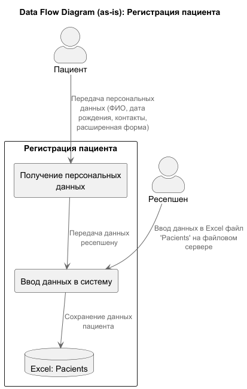
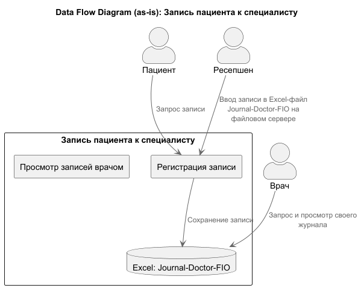
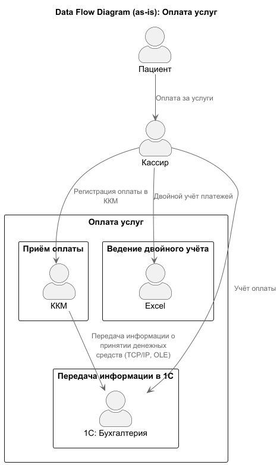
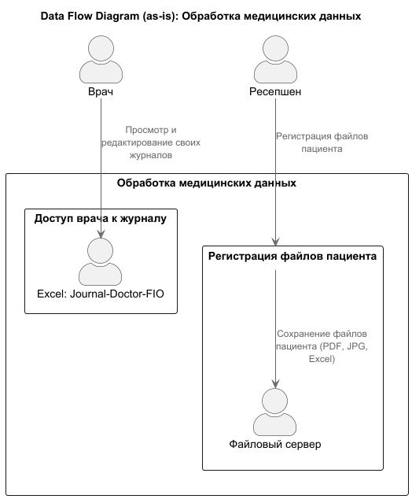
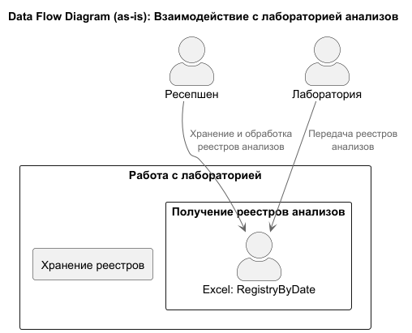
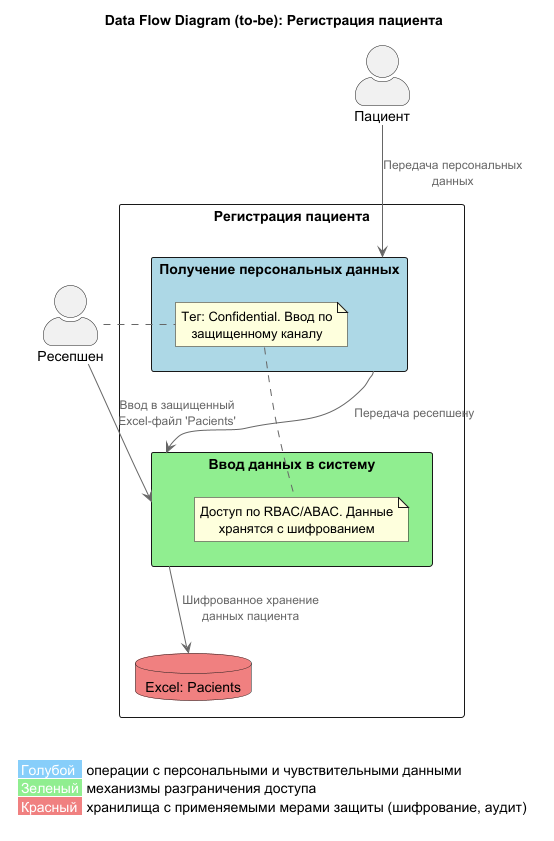
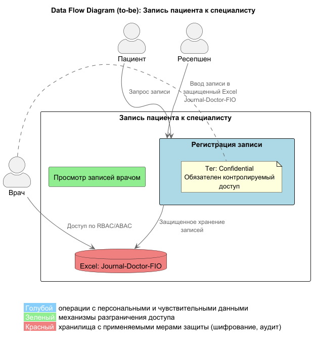
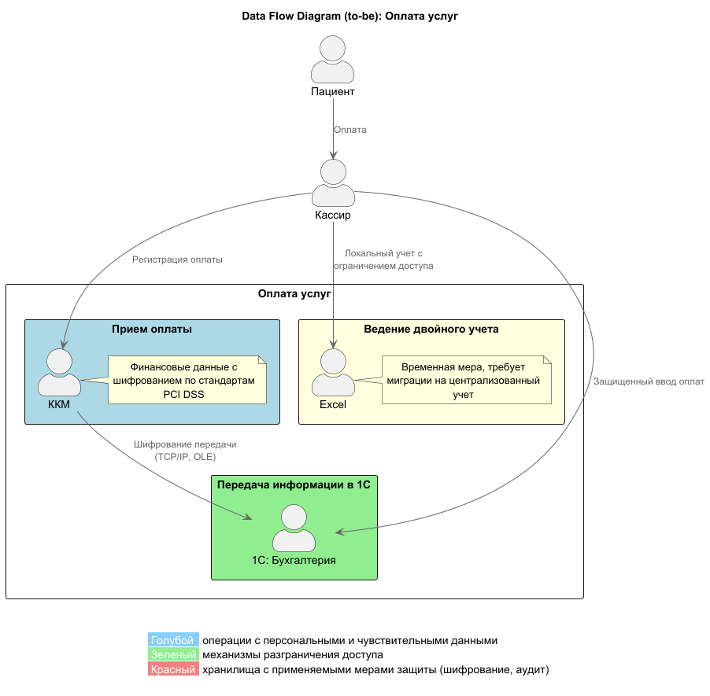
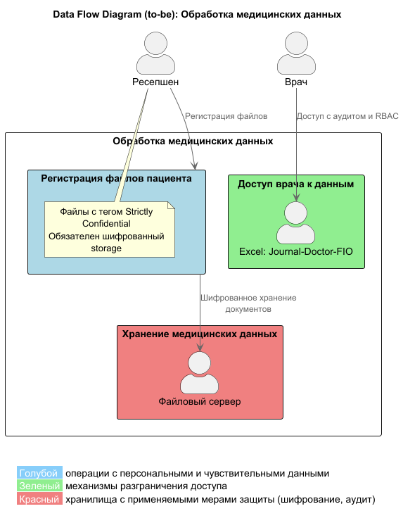
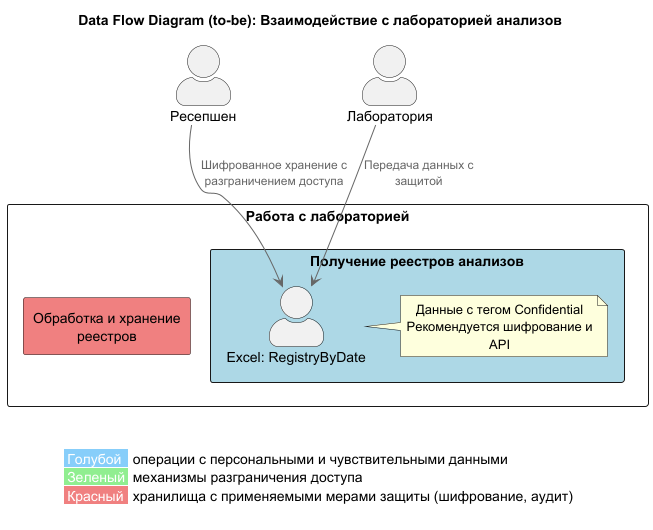

### Проблемы
- Данные пациента и журнал записей хранятся в Excel и на общем диске без централизованного управления
- Отсутствие аудита доступа и контроля прав на чтение/запись
- Работа с данными ведется вручную, высокая вероятность ошибок и утечек
- Множество файлов и систем, не интегрированы между собой
- Недостаточный уровень защиты конфиденциальных данных (например, отсутствие шифрования, жестких прав доступа)

### Основные процессы с конфиденциальными и PII-данными
- Регистрация пациента в системе (персональные данные, медицинские карты)
- Запись пациента к специалисту (ведение журнала приема)
- Оплата услуг (денежные операции через кассу и 1С)
- Обработка медицинских данных (анализы, заключения)
- Взаимодействие с лабораторией анализов (реестры, данные)

### Диаграммы потоков данных (as-is)
1. Регистрация пациента в системе

   

2. Запись пациента к специалисту

   

3. Оплата услуг

   

4. Обработка медицинских данных

   

5. Взаимодействие с лабораторией анализов

   

### Аудит мер по обеспечению безопасности данных
| Процесс | Применимые требования безопасности                                                    | Выводы по текущему состоянию                                                                                                |
|-------------------------------|---------------------------------------------------------------------------------------|-----------------------------------------------------------------------------------------------------------------------------|
| Регистрация пациента | Закон о персональных данных РФ, шифрование, разграничение доступа, минимизация данных | Данные пациентов вводятся и хранятся в Excel без шифрования и централизации. Отсутствует разграничение доступа по ролям    |
| Запись пациента к врачу | Контроль доступа, аудит доступа, целостность данных                                   | Записи в Excel, доступ открыт для врачей и ресепшена без детального аудита и контроля прав                                 |
| Обработка оплаты | Защита финансовых данных, целостность транзакций                                      | Используются ККМ и 1С в файловом режиме, связаны через OLE/TCP, что уязвимо. Двойной учет вручную увеличивает риск ошибок |
| Обработка медицинских данных | Максимальная конфиденциальность, шифрование, аудит                                    | Медицинские карты и анализы хранятся как файлы на общем сервере без шифрования и аудита. Высокие риски утечек              |
| Взаимодействие с лабораторией | Защищенный обмен данными, минимизация доступа, аутентификация                         | Данные передаются через Excel-реестры без API, шифрования и авторизации. Отсутвует контроль доступа                        |

### Список проблемных зон
- Отсутствие централизованного хранилища данных с разграничением доступа: данные разбросаны по Excel-файлам и общему серверу без использования баз данных и систем контроля доступа
- Нет шифрования и защиты конфиденциальных данных при хранении и передаче
- Ручная обработка и учет данных: высокая вероятность ошибок, дублирование информации и неэффективность контроля
- Недостаточный контроль и аудит доступа: невозможно отследить, кто и когда получал доступ к данным, что критично для PII и медицинских данных
- Слабая интеграция IT-систем: связки через файловый режим и OLE технологию уязвимы и устарели
- Отсутствие механизмов минимизации данных и Privacy By Design: все данные хранятся в открытом виде, без классификации и тегирования
- Риски утечек через общий файловый сервер и отсутствие защиты носителей
- Риски из-за двойного учета платежей и несовершенства процессов, создающих финансовые и репутационные риски

### Улучшения
1. Список данных для защиты и способы защиты

|Тип данных| Способы защиты                                                                                     |
|-------------------------------|----------------------------------------------------------------------------------------------------|
|Персональные данные пациентов| Шифрование, обфускация, разграничение доступа (RBAC/ABAC)                                          
|Медицинские данные (диагнозы, анализы, медицинские карты)| Шифрование, аудит доступа, тегирование конфиденциальности, обфускация, обезличивание для аналитики 
|Платежные данные и финансовая информация| Шифрование, контроль целостности, аудит операций, сегрегация доступа                               
|Внутренние данные сотрудников| Шифрование, разграничение доступа, контроль аудита доступа                                         
|Логи доступа и действий| Хранение с защитой, аудит, мониторинг аномалий                                                     

2. Разработка механизма тегирования данных
- Тегирование данных должно классифицировать данные по уровню конфиденциальности (например, Public, Internal, Confidential, Strictly Confidential)
- Теги прикрепляются к каждому объекту данных в системе - записям, файлам, API
- Механизм тегирования позволит автоматически применять политики доступа и защиты в зависимости от тега
- Для реализации можно использовать инструменты управления метаданными и Data Governance (например, Apache Atlas, Collibra)
- В приложении тегирование интегрируется с аудиторской системой для мониторинга и алертов на доступ к чувствительным данным

3. Список инструментов и мер для обеспечения конфиденциальности
- Централизованное хранилище данных с поддержкой RBAC/ABAC (например, СУБД PostgreSQL с расширениями безопасности, Kubernetes Secrets)
- Шифрование данных на уровне базы и файлов (AES-256)
- Система аудита и мониторинга (например, ELK Stack, Prometheus с алертами)
- API Gateway с разграничением доступа и шифрованием (OAuth2, JWT)
- Тегирование и управление метаданными
- Системы контроля доступа к файловым ресурсам (Active Directory, LDAP)
- Утилиты по обезличиванию и обфускации данных для аналитики и отчетности
- Политики сроков хранения и удаления данных на основе GDPR/ФЗ-152

### Диаграммы потоков данных (to-be)
1. Регистрация пациента в системе

   

2. Запись пациента к специалисту

   

3. Оплата услуг

   

4. Обработка медицинских данных

   

5. Взаимодействие с лабораторией анализов

   
