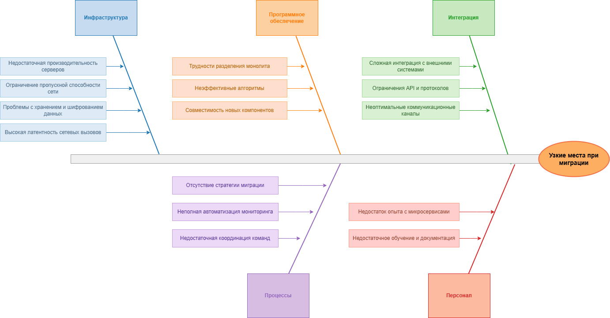

### Анализ ситуации
- **Текущая система**: устаревшая монолитная система с хранением данных в Excel и файловым сервером, процессы связанны с 1С, ККМ, лабораторией и почтой
- **Цели миграции**: переход к масштабируемой, устойчивой архитектуре микросервисов с обеспечением Privacy By Design и современными механизмами безопасности
- **Ключевые компоненты при миграции**:
  - Централизованное хранилище с тегированием и шифрованием
  - IAM и механизмы разграничения доступа
  - Аудит и мониторинг
  - API-шлюз интеграции
  - Внешние системы (1С, лаборатория, почта, ККМ)
- **Ключевые процессы**: регистрация пациентов, запись, оплата, обработка медицинских данных, взаимодействие с лабораторией

### Диаграмма Исикавы

### Рекомендации по устранению узких мест и приоритетность
|Мера|Категория|Приоритет|Обоснование и эффект|
|-|-|-|-|
|Модернизация серверного оборудования и сети|Инфраструктура|Высокий|Обеспечит производительность и снизит задержки|
|Построение четкой архитектуры микросервисов с модульным тестированием|Программное обеспечение|Высокий|Уменьшит количество ошибок и обеспечит масштабируемость|
|Создание интеграционного слоя с современными API и преобразованиями данных|Интеграция|Высокий|Облегчит работу с внешними системами|
|Обучение и повышение квалификации сотрудников|Персонал|Средний|Сократит ошибки и повысит эффективность работы|
|Внедрение CI/CD с автоматическим тестированием и мониторингом|Процессы|Высокий|Ускорит релизы и снизит риски выхода с ошибками|
|Автоматизация мониторинга и управления событиями безопасности|Процессы|Средний|Повысит быстроту реагирования на инциденты|

### Итоговый отчет
**Основные выявленные проблемы**
- Физическая инфраструктура не готова к нагрузкам микросервисов и шифрования
- Сложность разделения монолита на микросервисы с сохранением корректности бизнес-логики
- Ограничения интеграции с устаревшими внешними системами
- Недостаток навыков у персонала
- Отсутствие полноценного автоматического тестирования и мониторинга

**Предложенные решения**
- Инвестиции в инфраструктуру и микросервисную архитектуру
- Разработка интеграционного слоя для перехода от монолитных связей
- Обучение сотрудников и смена процессов разработки
- Внедрение средств автоматизации тестирования и наблюдения

